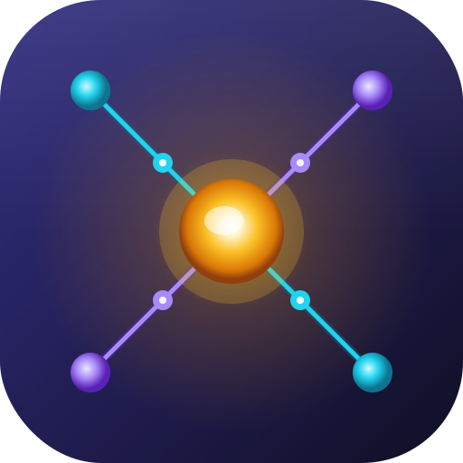

# SVNexus

SVNexus is a modern, cross-platform Subversion (SVN) client designed for performance and ease of use. Built with **Avalonia UI** for a fluid C# frontend and **Rust** for a robust, high-performance engine, SVNexus combines a native feel with modern UI conventions.



## ✨ Features

- **🚀 High Performance**: Powered by a Rust backend with direct bindings to Subversion C libraries.
- **📑 Multi-Tab Interface**: Manage multiple repositories or working copies simultaneously using the integrated Tabalonia system.
- **🖥️ Cross-Platform**: Native support for **Windows**, **Linux**, and **macOS**.
- **🔍 Advanced Diff & Merge**: Visual file comparison with syntax highlighting via AvaloniaEdit.
- **📂 Working Copy Management**: 
    - Full support for standard SVN operations: `Checkout`, `Commit`, `Update`, `Revert`, `Delete`, `Mkdir`.
    - Local and Remote repository exploration.
    - Lock/Unlock management.
- **📜 History & Logs**: Persistent history tracking using SQLite (SeaORM).
- **🎨 Modern UI**: Beautifully themed with **Semi.Avalonia** for a clean, professional look.

## 🖥️ Platform Support

SVNexus aims to be truly cross-platform. Below is the current status of platform support:

| OS | Architecture | Status |
| :--- | :--- | :--- |
| **macOS** | Apple Silicon (aarch64) | ✅ Supported |
| **macOS** | Intel (x64) | 🛠️ Planned |
| **Linux** | x64 | ✅ Supported |
| **Linux** | aarch64 | 🛠️ Planned |
| **Linux** | LoongArch | 🛠️ Planned |
| **Windows** | x64 | 🛠️ Planned |

*Note: For currently supported platforms, pre-built Subversion dependencies are included in the repository.*

## 🛠️ Tech Stack

- **Frontend**: 
    - [Avalonia UI](https://avaloniaui.net/) (Cross-platform .NET UI framework)
    - [CommunityToolkit.Mvvm](https://github.com/CommunityToolkit/dotnet)
    - [Semi.Avalonia](https://github.com/irihitech/Semi.Avalonia) (Fluent design system)
- **Backend (Engine)**: 
    - [Rust](https://www.rust-lang.org/)
    - [UniFFI](https://github.com/mozilla/uniffi-rs) (C# to Rust interop)
    - [SeaORM](https://www.sea-ql.org/SeaORM/) (SQLite management for history)
    - [Subversion C Bindings](https://subversion.apache.org/) (wrapped via bindgen)
- **Build System**: 
    - .NET 10.0 SDK
    - Rust Toolchain (Cargo)
    - Python-based packaging script (`package.py`)

## 🚀 Getting Started

### Prerequisites

- **.NET SDK**: `net10.0` or higher.
- **Rust**: Latest stable toolchain.
- **Subversion Dependencies**: The project includes pre-built dependencies for common platforms in `SVNexus/rust/deps`, but you may need local development headers (`libsvn-dev`, `libapr1-dev`) for custom builds.

### Building from Source

1. **Clone the repository**:
   ```bash
   git clone https://github.com/holdxen/SVNexus.git
   ```
2. **Install build tool**:
   ```bash
   cd csr
   cargo install --path .
   ```

3. **Build the Rust Engine**:
   ```bash
   cd ../SVNexus
   csr
   ```

4. **Build the C# Frontend**:
   ```bash
   dotnet build -c Release
   ```

### Packaging

The project provides a `package.py` script to automate the creation of platform-specific installers (e.g., `.deb` for Linux, `.dmg` for macOS):

```bash
cd SVNexus
python3 package.py
```

## 📄 License

SVNexus is licensed under the **GNU General Public License v3.0**. See the [LICENSE](LICENSE) file for details.

## 🤝 Contributing

Contributions are welcome! Please feel free to submit a Pull Request or open an Issue for bug reports and feature requests.

---

*SVNexus - Bringing Subversion to the modern era.*
