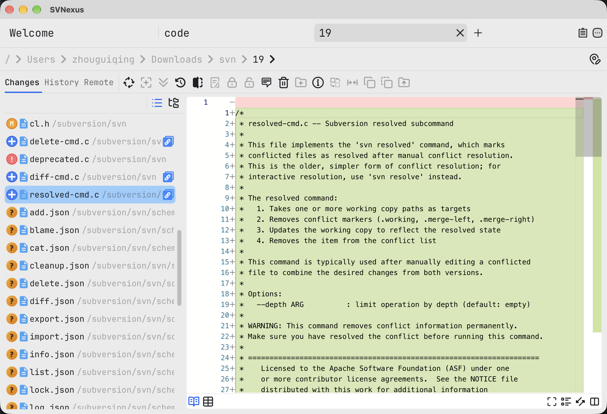

# SVNexus

Cross-platform Subversion desktop client built on Tauri 2.

**Repositories:** [GitHub](https://github.com/holdxen/SVNexus) | [SourceForge](https://sourceforge.net/projects/svnexus/)

**[中文](./README.zh.md)**

## Features

- **Full SVN Operations** — checkout, commit, update, add, delete, revert, switch, merge, relocate, and more
- **Diff Viewer** — built-in code editor for inspecting file changes side by side
- **Commit History** — browse logs, view changed paths, and inspect revision snapshots
- **Workspace Management** — group multiple workspaces; work across tabs in parallel without interference
- **Conflict Resolution** — detect and resolve merge conflicts with a guided workflow
- **File Locking** — lock / unlock support
- **Property Editing** — view and modify SVN properties on files and directories, including versioned props

## TODO

- [ ] SSH protocol support with OpenSSH compatibility
- [ ] File history version browsing
- [ ] Standalone remote repository browsing
- [ ] One-click bug reporting
- [ ] Hunk-level revert for working copy changes
- [ ] Display current working copy revision in History view
- [ ] Cross-tab navigation from error toasts
- [ ] Support copy and move operations
- [ ] Improve merge operations
- [ ] Rust code optimization, pass cargo clippy and fmt checks

## Installation

Download the installer for your platform from the [Releases](../../releases) page:

- **macOS** — `.dmg`
- **Windows** — `.msi` / `.exe`
- **Linux** — `.deb` / `.rpm` / `.AppImage`

## Usage

### Add a Workspace

Launch SVNexus and click "Add Workspace" on the welcome page. Select an existing local SVN working copy, or check out a remote repository directly.

### Basic Operations

In the workspace view:

- **View Status** — the left-hand tree shows file statuses (modified, unversioned, conflicted, etc.)
- **Commit Changes** — select files, click Commit, and enter a log message
- **View Diffs** — double-click a modified file to open the diff viewer
- **View History** — right-click a file or directory to see its commit history
- **Update / Revert** — one-click update or revert selected files from the toolbar

### Multi-Tab

Open multiple workspaces simultaneously and switch between them via top tabs — ideal for managing several repositories at once.

## System Requirements

| Platform | Minimum Version           |
| -------- | ------------------------- |
| macOS    | 11+ (Apple Silicon build) |
| Windows  | 10+                       |
| Linux    | GTK 3 mainstream distros  |

## Feedback & Issues

Encountered a problem or have a feature request? Feel free to open an [Issue](../../issues).

## License

[AGPL-3.0](./LICENSE.txt)
